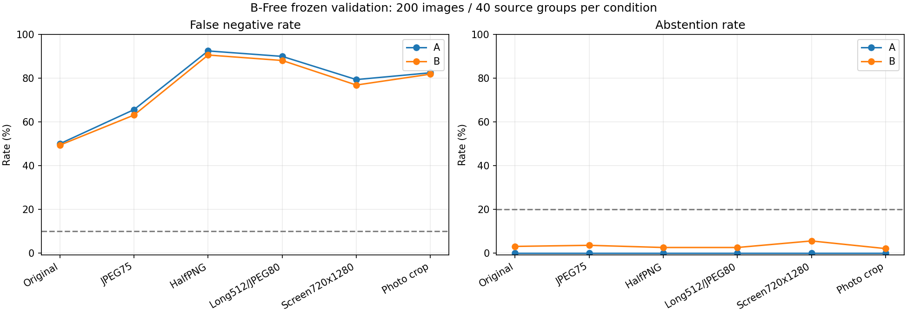
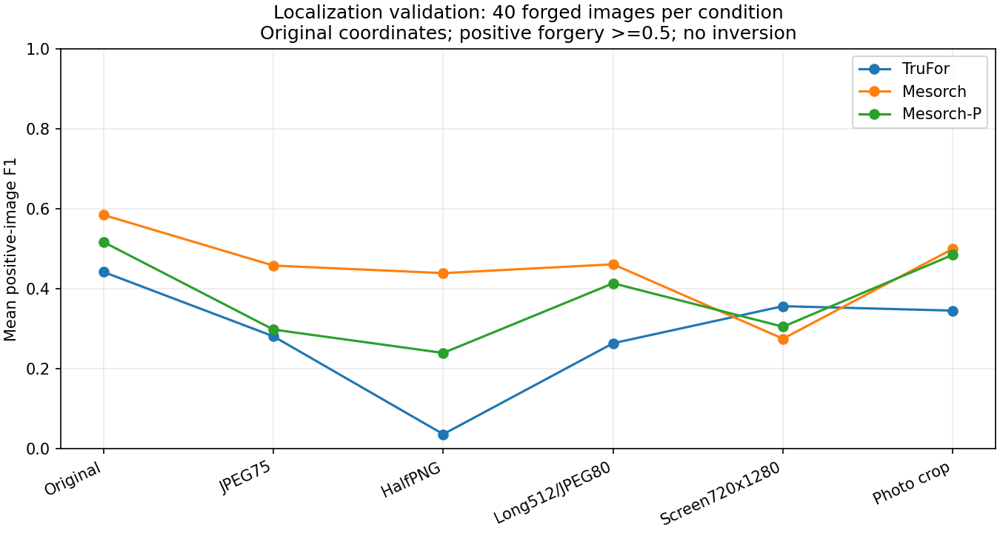
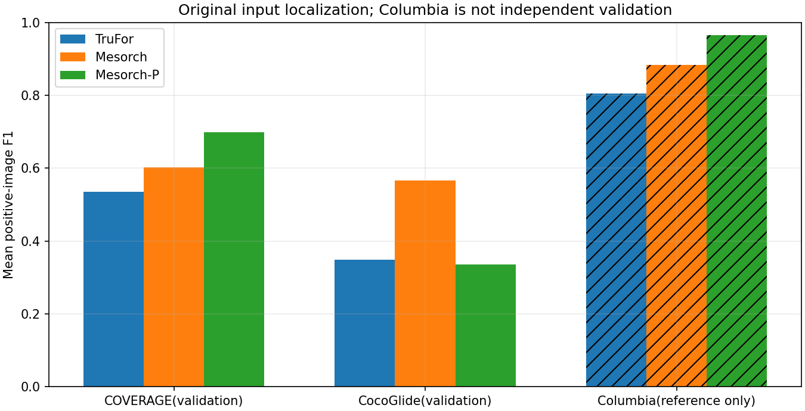

# 추가 Baseline 검증 결과 — 2026-10-04

**B-Free 원본 400장, 변조 탐지 원본 240장에 원본·입력 변형 5종을 평가했다. 총 6,720개 모델·입력 요청 중 6,720개 정상 처리, 0개 실패이다.** 작업 폴더는 프로젝트 루트이다. 기존 v0.1 결과·환경·모델 코어는 보존했다.

| 모델 | 설정 전체 후보 선택 | 선택 후보 | CV에서 선택 성공한 분할 |
|---|---|---|---|
| B-Free | 선택 실패 | 없음 | 0/5 |
| TruFor | 선택 실패 | 없음 | 0/5 |
| Mesorch | 선택 실패 | 없음 | 0/5 |
| Mesorch-P | 선택 실패 | 없음 | 0/5 |

후보 선택 목표는 **각 입력 조건에서 오탐률 ≤5%·미탐률 ≤10%·보류율 ≤20%**이다. 목표를 만족하는 후보가 없으면 실패로 기록하고, 사전에 정한 비교 기준만 검증했다. 교차검증은 설정용 내 장면 그룹 5분할이며 별도 검증 결과가 아니다.

## 결과 해석과 결정 근거

**B-Free 판정 기준 변경은 보류한다.** 사전 후보 중 모든 입력 조건에서 목표를 만족하는 정책이 없어 이번 실험은 개선된 서비스 기준을 선정하지 못했다. 원본 결과만으로 압축·축소·화면 입력까지 지원한다고 판단하지 않는다.
TruFor 원본 평균F1은 0.442이다. Mesorch 원본 평균F1 0.584, TruFor보다 높은 입력 조건 5/6; Mesorch-P 원본 평균F1 0.517, TruFor보다 높은 입력 조건 5/6이다. 자료별·입력별 결과와 오탐/미탐을 함께 검토해야 한다. Mesorch 계열에는 공식 이미지 분류 점수가 없어 위치 개선만으로 기존 탐지 응답을 바로 교체할 근거가 되지 않는다.

## 실제 평가 구성

| 분야/자료 | 원본 수 | 설정용 원본 | 검증용 원본 | 참고 비교 원본 |
|---|---|---|---|---|
| B-Free / SynthBuster+ | 200 | 100 | 100 | 0 |
| B-Free / SynthCLIC | 200 | 100 | 100 | 0 |
| 변조 / COVERAGE | 80 | 40 | 40 | 0 |
| 변조 / CocoGlide | 80 | 40 | 40 | 0 |
| 변조 / Columbia | 80 | 0 | 0 | 80 |

B-Free 각 자료는 실제 사진 40장과 동일 원본에 연결된 Imagen3·FLUX.1-dev·FLUX.1-schnell·SD3-medium 각40장이다. 원본 장면 기준으로 설정용200장/검증용200장을 분리했다. 설정용은 시각적으로 유사한 장면을 묶은 **34그룹**, 검증용은 **40그룹**이다. 변조의 설정용·검증용은 각각 **40원본 쌍 그룹/80장**이다. 같은 원본의 실제·생성·편집·변형은 같은 소속이다.

**초안 변경:** Columbia의 원본·합성 출처를 보수적으로 연결하면 변조180장 모두가 기존 노출 장면과 같은 연결요소에 속한다. 이 때문에 Columbia80장은 설정이나 독립 검증에 포함하지 않았다. 전체240장은 유지하되 설정80/검증80/참고80으로 조정했다. 범위 선호 질문을 제시하고, 답변이 기록되지 않은 동안 과학적 독립성을 보존하는 기본 구성으로 진행했다. 이 조정을 사용자의 별도 승인으로 서술하지 않는다.

COVERAGE는 기존20쌍과 원본/마스크 오류 자료를 제외했다. 유사한 컵케이크 장면83·96은 양쪽에 나누지 않고83을 같은 유형의80으로 교체했다. B-Free는 기존 원본ID를 제외하고, 이전 퍼레이드·시계·박물관·호수와 공유가 의심되는 검증 장면6개를 점수 확인 전에 교체했다. 설정용 유사 호수·고양이·튤립 장면은 같은 CV그룹에 묶었다. 이 검수는 모든 촬영 행사·장소 또는 모델 사전학습 데이터와의 독립성을 증명하지 않는다.

| 입력 조건 | 고정 처리 |
|---|---|
| 원본 | 추가 압축·크기 변경 없음 |
| JPEG q75 | 같은 크기, q75, subsampling2 |
| 가로·세로1/2 PNG | LANCZOS 축소, 정답 NEAREST |
| 긴 변512 JPEG q80 | 확대하지 않음, q80, subsampling2 |
| 720×1280 화면 재현 | 고정 UI 및 사진 상자, 정답에 같은 기하 변환 |
| 화면 사진 영역 | 알려진 사진 상자를 잘라낸 입력, 자동 영역 검출 아님 |

입력 변형은 기존 v0.1 함수로 생성했다. 실제 메신저 저장·실기기 화면 캡처 측정은 아니며, 화면 사진 상자는 알고 있는 재현 위치를 사용했다. 정답은 이진값·크기·해시를 검증했고, 양성 정답이 사라진 변형은 없었다.

## B-Free 검증 결과

| 모델 | 입력 | 기준 | 오탐/음성 | 오탐률 | 미탐/양성 | 미탐률 | 보류/전체 | 보류율 | 균형 정확도 |
|---|---|---|---|---|---|---|---|---|---|
| B-Free | 원본 | A | 0/40 | 0.0% | 80/160 | 50.0% | 0/200 | 0.0% | 75.0% |
| B-Free | 원본 | B | 0/40 | 0.0% | 79/160 | 49.4% | 6/200 | 3.0% | 73.4% |
| B-Free | JPEG q75 | A | 0/40 | 0.0% | 105/160 | 65.6% | 0/200 | 0.0% | 67.2% |
| B-Free | JPEG q75 | B | 0/40 | 0.0% | 101/160 | 63.1% | 7/200 | 3.5% | 66.2% |
| B-Free | 가로·세로 1/2 PNG | A | 0/40 | 0.0% | 148/160 | 92.5% | 0/200 | 0.0% | 53.8% |
| B-Free | 가로·세로 1/2 PNG | B | 0/40 | 0.0% | 145/160 | 90.6% | 5/200 | 2.5% | 53.1% |
| B-Free | 긴 변 512 JPEG q80 | A | 1/40 | 2.5% | 144/160 | 90.0% | 0/200 | 0.0% | 53.8% |
| B-Free | 긴 변 512 JPEG q80 | B | 1/40 | 2.5% | 141/160 | 88.1% | 5/200 | 2.5% | 53.1% |
| B-Free | 720×1280 화면 재현 | A | 0/40 | 0.0% | 127/160 | 79.4% | 0/200 | 0.0% | 60.3% |
| B-Free | 720×1280 화면 재현 | B | 0/40 | 0.0% | 123/160 | 76.9% | 11/200 | 5.5% | 57.2% |
| B-Free | 화면의 사진 영역 | A | 0/40 | 0.0% | 132/160 | 82.5% | 0/200 | 0.0% | 58.8% |
| B-Free | 화면의 사진 영역 | B | 0/40 | 0.0% | 131/160 | 81.9% | 4/200 | 2.0% | 57.8% |

A는 원래 logit>0이고, B는 sigmoid 점수<0.4 음성, 0.4~0.6 양끝 포함 보류, >0.6 양성이다. 이 점수는 사기 확률이 아니다. 각 조건의 분모는 실제40장·생성160장이다. 원본과 변형이나 네 생성기 결과를 독립 관측으로 합산하지 않는다.

| 입력 | AUROC | AP | 양성 비율 |
|---|---|---|---|
| 원본 | 0.8819 | 0.9706 | 80% |
| JPEG q75 | 0.7922 | 0.9440 | 80% |
| 가로·세로 1/2 PNG | 0.5134 | 0.8427 | 80% |
| 긴 변 512 JPEG q80 | 0.4773 | 0.8159 | 80% |
| 720×1280 화면 재현 | 0.6286 | 0.8932 | 80% |
| 화면의 사진 영역 | 0.6442 | 0.8977 | 80% |

AUROC/AP는 sigmoid 포화로 동점이 생기는 문제를 피하도록 원래 logit으로 계산했다. 생성기·자료별 전체 표와 후보 탐색 기록은 evaluation.json과 정책 고정 파일에 있다. 높은 AUROC/AP가 정한 기준의 미탐을 대신하지 않는다.

## 변조 탐지 검증 결과

| 모델 | 입력 | 양성 위치 평가 수 | 평균 F1 | 평균 IoU | 음성 오표시 면적 |
|---|---|---|---|---|---|
| TruFor | 원본 | 40 | 0.442 | 0.378 | 1.9% |
| Mesorch | 원본 | 40 | 0.584 | 0.526 | 3.4% |
| Mesorch-P | 원본 | 40 | 0.517 | 0.458 | 2.9% |
| TruFor | JPEG q75 | 40 | 0.281 | 0.218 | 2.7% |
| Mesorch | JPEG q75 | 40 | 0.458 | 0.398 | 6.3% |
| Mesorch-P | JPEG q75 | 40 | 0.298 | 0.260 | 4.1% |
| TruFor | 가로·세로 1/2 PNG | 40 | 0.037 | 0.026 | 0.4% |
| Mesorch | 가로·세로 1/2 PNG | 40 | 0.439 | 0.367 | 11.5% |
| Mesorch-P | 가로·세로 1/2 PNG | 40 | 0.240 | 0.205 | 4.1% |
| TruFor | 긴 변 512 JPEG q80 | 40 | 0.264 | 0.212 | 2.2% |
| Mesorch | 긴 변 512 JPEG q80 | 40 | 0.461 | 0.405 | 3.9% |
| Mesorch-P | 긴 변 512 JPEG q80 | 40 | 0.414 | 0.365 | 3.4% |
| TruFor | 720×1280 화면 재현 | 40 | 0.356 | 0.243 | 40.1% |
| Mesorch | 720×1280 화면 재현 | 40 | 0.275 | 0.228 | 0.7% |
| Mesorch-P | 720×1280 화면 재현 | 40 | 0.305 | 0.256 | 0.8% |
| TruFor | 화면의 사진 영역 | 40 | 0.345 | 0.267 | 9.4% |
| Mesorch | 화면의 사진 영역 | 40 | 0.500 | 0.452 | 3.1% |
| Mesorch-P | 화면의 사진 영역 | 40 | 0.485 | 0.434 | 1.3% |

위치 평가는 **원래 입력 좌표**, 공식 변조 양성 방향, 지도값≥0.5로 고정했고 정답을 이용해 방향을 뒤집지 않았다. F1/IoU는 양성 이미지별 값을 평균하고, 음성의 잘못 표시한 면적 비율은 따로 계산했다. Mesorch의512지도를 원래 좌표에 bilinear, align_corners=False로 복원했다. 이는 평가용 어댑터 처리이며 공식 CLI가 원래 좌표로 복원한다고 주장하지 않는다.

| 모델 | 자료 | 역할 | 양성 수 | 원본 평균 F1 | 원본 평균 IoU |
|---|---|---|---|---|---|
| TruFor | COVERAGE | 검증 | 20 | 0.536 | 0.463 |
| TruFor | CocoGlide | 검증 | 20 | 0.348 | 0.294 |
| TruFor | Columbia | 비독립 참고 | 40 | 0.805 | 0.751 |
| Mesorch | COVERAGE | 검증 | 20 | 0.602 | 0.553 |
| Mesorch | CocoGlide | 검증 | 20 | 0.567 | 0.500 |
| Mesorch | Columbia | 비독립 참고 | 40 | 0.884 | 0.870 |
| Mesorch-P | COVERAGE | 검증 | 20 | 0.698 | 0.624 |
| Mesorch-P | CocoGlide | 검증 | 20 | 0.335 | 0.293 |
| Mesorch-P | Columbia | 비독립 참고 | 40 | 0.964 | 0.954 |

| 모델 | 입력 | 기준/집계 | 오탐/음성 | 오탐률 | 미탐/양성 | 미탐률 | 보류/전체 | 보류율 | 균형 정확도 |
|---|---|---|---|---|---|---|---|---|---|
| TruFor | 원본 | A | 4/40 | 10.0% | 21/40 | 52.5% | 0/80 | 0.0% | 68.8% |
| TruFor | 원본 | B | 1/40 | 2.5% | 17/40 | 42.5% | 13/80 | 16.2% | 61.3% |
| TruFor | JPEG q75 | A | 8/40 | 20.0% | 21/40 | 52.5% | 0/80 | 0.0% | 63.7% |
| TruFor | JPEG q75 | B | 6/40 | 15.0% | 20/40 | 50.0% | 9/80 | 11.2% | 56.2% |
| TruFor | 가로·세로 1/2 PNG | A | 1/40 | 2.5% | 38/40 | 95.0% | 0/80 | 0.0% | 51.2% |
| TruFor | 가로·세로 1/2 PNG | B | 0/40 | 0.0% | 33/40 | 82.5% | 8/80 | 10.0% | 48.8% |
| TruFor | 긴 변 512 JPEG q80 | A | 11/40 | 27.5% | 20/40 | 50.0% | 0/80 | 0.0% | 61.3% |
| TruFor | 긴 변 512 JPEG q80 | B | 3/40 | 7.5% | 17/40 | 42.5% | 18/80 | 22.5% | 52.5% |
| TruFor | 720×1280 화면 재현 | A | 36/40 | 90.0% | 3/40 | 7.5% | 0/80 | 0.0% | 51.3% |
| TruFor | 720×1280 화면 재현 | B | 35/40 | 87.5% | 3/40 | 7.5% | 4/80 | 5.0% | 47.5% |
| TruFor | 화면의 사진 영역 | A | 6/40 | 15.0% | 28/40 | 70.0% | 0/80 | 0.0% | 57.5% |
| TruFor | 화면의 사진 영역 | B | 3/40 | 7.5% | 21/40 | 52.5% | 15/80 | 18.8% | 51.2% |
| Mesorch | 원본 | mean_binary_0.5 | 1/40 | 2.5% | 37/40 | 92.5% | 0/80 | 0.0% | 52.5% |
| Mesorch | 원본 | max_binary_0.5 | 28/40 | 70.0% | 3/40 | 7.5% | 0/80 | 0.0% | 61.3% |
| Mesorch | 원본 | top1_binary_0.5 | 16/40 | 40.0% | 6/40 | 15.0% | 0/80 | 0.0% | 72.5% |
| Mesorch | JPEG q75 | mean_binary_0.5 | 0/40 | 0.0% | 39/40 | 97.5% | 0/80 | 0.0% | 51.2% |
| Mesorch | JPEG q75 | max_binary_0.5 | 30/40 | 75.0% | 2/40 | 5.0% | 0/80 | 0.0% | 60.0% |
| Mesorch | JPEG q75 | top1_binary_0.5 | 22/40 | 55.0% | 9/40 | 22.5% | 0/80 | 0.0% | 61.3% |
| Mesorch | 가로·세로 1/2 PNG | mean_binary_0.5 | 1/40 | 2.5% | 38/40 | 95.0% | 0/80 | 0.0% | 51.2% |
| Mesorch | 가로·세로 1/2 PNG | max_binary_0.5 | 38/40 | 95.0% | 1/40 | 2.5% | 0/80 | 0.0% | 51.2% |
| Mesorch | 가로·세로 1/2 PNG | top1_binary_0.5 | 29/40 | 72.5% | 7/40 | 17.5% | 0/80 | 0.0% | 55.0% |
| Mesorch | 긴 변 512 JPEG q80 | mean_binary_0.5 | 0/40 | 0.0% | 39/40 | 97.5% | 0/80 | 0.0% | 51.2% |
| Mesorch | 긴 변 512 JPEG q80 | max_binary_0.5 | 32/40 | 80.0% | 3/40 | 7.5% | 0/80 | 0.0% | 56.2% |
| Mesorch | 긴 변 512 JPEG q80 | top1_binary_0.5 | 20/40 | 50.0% | 8/40 | 20.0% | 0/80 | 0.0% | 65.0% |
| Mesorch | 720×1280 화면 재현 | mean_binary_0.5 | 0/40 | 0.0% | 40/40 | 100.0% | 0/80 | 0.0% | 50.0% |
| Mesorch | 720×1280 화면 재현 | max_binary_0.5 | 16/40 | 40.0% | 11/40 | 27.5% | 0/80 | 0.0% | 66.2% |
| Mesorch | 720×1280 화면 재현 | top1_binary_0.5 | 8/40 | 20.0% | 19/40 | 47.5% | 0/80 | 0.0% | 66.3% |
| Mesorch | 화면의 사진 영역 | mean_binary_0.5 | 0/40 | 0.0% | 39/40 | 97.5% | 0/80 | 0.0% | 51.2% |
| Mesorch | 화면의 사진 영역 | max_binary_0.5 | 27/40 | 67.5% | 3/40 | 7.5% | 0/80 | 0.0% | 62.5% |
| Mesorch | 화면의 사진 영역 | top1_binary_0.5 | 16/40 | 40.0% | 6/40 | 15.0% | 0/80 | 0.0% | 72.5% |
| Mesorch-P | 원본 | mean_binary_0.5 | 0/40 | 0.0% | 39/40 | 97.5% | 0/80 | 0.0% | 51.2% |
| Mesorch-P | 원본 | max_binary_0.5 | 25/40 | 62.5% | 5/40 | 12.5% | 0/80 | 0.0% | 62.5% |
| Mesorch-P | 원본 | top1_binary_0.5 | 12/40 | 30.0% | 10/40 | 25.0% | 0/80 | 0.0% | 72.5% |
| Mesorch-P | JPEG q75 | mean_binary_0.5 | 0/40 | 0.0% | 40/40 | 100.0% | 0/80 | 0.0% | 50.0% |
| Mesorch-P | JPEG q75 | max_binary_0.5 | 29/40 | 72.5% | 7/40 | 17.5% | 0/80 | 0.0% | 55.0% |
| Mesorch-P | JPEG q75 | top1_binary_0.5 | 22/40 | 55.0% | 12/40 | 30.0% | 0/80 | 0.0% | 57.5% |
| Mesorch-P | 가로·세로 1/2 PNG | mean_binary_0.5 | 1/40 | 2.5% | 40/40 | 100.0% | 0/80 | 0.0% | 48.8% |
| Mesorch-P | 가로·세로 1/2 PNG | max_binary_0.5 | 24/40 | 60.0% | 9/40 | 22.5% | 0/80 | 0.0% | 58.8% |
| Mesorch-P | 가로·세로 1/2 PNG | top1_binary_0.5 | 13/40 | 32.5% | 18/40 | 45.0% | 0/80 | 0.0% | 61.3% |
| Mesorch-P | 긴 변 512 JPEG q80 | mean_binary_0.5 | 0/40 | 0.0% | 40/40 | 100.0% | 0/80 | 0.0% | 50.0% |
| Mesorch-P | 긴 변 512 JPEG q80 | max_binary_0.5 | 28/40 | 70.0% | 4/40 | 10.0% | 0/80 | 0.0% | 60.0% |
| Mesorch-P | 긴 변 512 JPEG q80 | top1_binary_0.5 | 20/40 | 50.0% | 13/40 | 32.5% | 0/80 | 0.0% | 58.8% |
| Mesorch-P | 720×1280 화면 재현 | mean_binary_0.5 | 0/40 | 0.0% | 40/40 | 100.0% | 0/80 | 0.0% | 50.0% |
| Mesorch-P | 720×1280 화면 재현 | max_binary_0.5 | 16/40 | 40.0% | 12/40 | 30.0% | 0/80 | 0.0% | 65.0% |
| Mesorch-P | 720×1280 화면 재현 | top1_binary_0.5 | 9/40 | 22.5% | 20/40 | 50.0% | 0/80 | 0.0% | 63.7% |
| Mesorch-P | 화면의 사진 영역 | mean_binary_0.5 | 0/40 | 0.0% | 40/40 | 100.0% | 0/80 | 0.0% | 50.0% |
| Mesorch-P | 화면의 사진 영역 | max_binary_0.5 | 19/40 | 47.5% | 7/40 | 17.5% | 0/80 | 0.0% | 67.5% |
| Mesorch-P | 화면의 사진 영역 | top1_binary_0.5 | 10/40 | 25.0% | 12/40 | 30.0% | 0/80 | 0.0% | 72.5% |

TruFor A는 공식 sigmoid(det)≥0.5, B는 양끝 포함0.4~0.6보류이다. **Mesorch·Mesorch-P에는 공식 이미지 단위 분류 점수가 없다.** mean/max/top1은 공식512지도에서 만든 평가용 집계 점수이며, 이 표의 기본 기준은 >0.5이다. top1은 값이 큰 ceil(픽셀 수×1%)의 평균이다. 이를 공식 탐지 헤드나 보정된 확률로 해석하지 않는다.

균형 정확도는 클래스별 정답률의 평균이다. 보류를 정답으로 세지 않고 각 실제 클래스 전체를 분모에 남겼다. 이 수치와 조건부 신뢰구간은 사전 후보 선택 규칙을 변경하지 않는다.

원본 위치 F1의 자료별 층화·원본 쌍 그룹 부트스트랩 95% 구간이다. 선택된 자료와 확인한 그룹 관계를 조건으로 한 불확실성이며 모든 서비스 입력을 대표하지 않는다.

| 모델 | 원본 평균 F1 | 조건부 95% 구간 |
|---|---|---|
| TruFor | 0.442 | 0.323~0.563 |
| Mesorch | 0.584 | 0.454~0.710 |
| Mesorch-P | 0.517 | 0.403~0.629 |

같은 이미지·같은 원본 쌍 재추출에서 계산한 원본 F1 차이도 별도로 기록한다. 여러 조건/모델 비교에 대한 다중검정 보정 구간은 아니며, 구간이 0을 포함하면 양의 평균 차이가 안정적이라는 증거가 약하다.

| 짝지은 비교 | 원본 평균 F1 차이 | 조건부 95% 구간 |
|---|---|---|
| Mesorch − TruFor | 0.142 | -0.003~0.276 |
| Mesorch-P − TruFor | 0.075 | -0.029~0.184 |

## 실행 시간·메모리와 구현 검증

| 모델 | 입력 | 정상 | 실패 | p50 초 | p95 초 | 최대 GPU 할당 GiB |
|---|---|---|---|---|---|---|
| B-Free | 원본 | 200 | 0 | 0.352 | 0.512 | 0.59 |
| B-Free | 720×1280 화면 재현 | 200 | 0 | 0.391 | 0.519 | 0.59 |
| TruFor | 원본 | 80 | 0 | 0.093 | 0.291 | 0.92 |
| TruFor | 720×1280 화면 재현 | 80 | 0 | 0.963 | 1.198 | 2.69 |
| Mesorch | 원본 | 80 | 0 | 0.161 | 0.217 | 0.74 |
| Mesorch | 720×1280 화면 재현 | 80 | 0 | 0.170 | 0.205 | 0.74 |
| Mesorch-P | 원본 | 80 | 0 | 0.102 | 0.119 | 0.33 |
| Mesorch-P | 720×1280 화면 재현 | 80 | 0 | 0.122 | 0.136 | 0.33 |

GTX1080Ti11GB에서 배치1·모델별 순차 실행했다. 시간은 동기화한 입력 전처리·전송·모델 추론·지도 복원/집계를 포함하고 모델 초기 로딩, 지도 파일 저장, 정답 지표 계산은 제외한다. GPU값은 PyTorch 최대 할당량으로 전체 드라이버·예약 메모리와 다르다. p95는 이번 고정 장비의 표본 측정이며 서비스 지연 보장이 아니다.

- 기존 B-Free/TruFor 환경은 수정하지 않았고, 데이터/그래프 환경과 Mesorch 환경을 분리했다.
- Mesorch 공식 소스 커밋은33454cb6d595267033ce1109b62ad373110678db이며 각 Git blob을 검증했다. 전체 모델의 실제 클래스는MesorchFull이다.
- Mesorch는 체크포인트 엄격 로딩, Mesorch-P는 공식 코드가 제거한convnext.head와stages.3잔여 가중치만 허용했다. 사용되는 가중치 누락은 없고 공식 소스를 편집하지 않았다.
- 공식 IMDLBenCo0.1.45 resize/Normalize/Crop/ToTensorV2를 사용했다. 무관한 모델·시각화 자동 import를 건너뛰는 어댑터를 기록했다.
- Mesorch README 권장Python3.10과 달리 기존 호환Python3.9.13·torch2.0.1+cu118·timm1.0.12를 사용했다. 별도 합성 입력에서 동작·좌표 복원·정답 대신0/1더미 마스크를 넣었을 때 예측 동일성을 검증했다. 실제 정답은 모델 호출 뒤 지표 계산에만 썼다.
- 정책 경계·후보 선택 실패·입력 조건 누락/추론 실패·검증 데이터의 선택 차단·장면 그룹CV분리·위치 지표/좌표 검사의6개 단위 검사가 통과했다.

## 수행하지 않은 범위

**FakeShield는 실행 가능성 사전 점검만 수행했다.** 공식 DTE-FDM 텐서 크기만27,308,693,504바이트로11GB GPU의 전체 GPU 적재 범위를 넘는다. 실제 모델 추론이나 OOM실험을 수행했다고 기록하지 않는다. 양자화·CPU offload·해상도 변경·유료GPU·외부 업로드는 적용하지 않았다. 따라서 FakeShield 설명 출력, 2인 검토에 의한 설명 정확성·이해도 평가는 미수행이다. 실기기/메신저 실제 캡처도 미수행이며 이번5종은 입력 재현이다.

## 오류 사례와 해석 범위

B-Free 미탐 사진 예시는 재배포 조건 확인 전까지 공개 사본에서 제외했다.

변조 지도와 원본 사진 예시는 공개 사본에서 제외했다.

오류 그림은 검증 완료 뒤 고정된 기준으로 골라 보여주는 사후 설명 자료이다. 이 그림을 보고 기준·모델·입력을 다시 조정하지 않았다. 검증 표본을 좋은 결과가 나올 때까지 반복 평가하거나 Columbia 참고 결과를 독립 검증으로 합치지 않았다.

오탐/미탐의 분모는 정상 추론된 음성/양성 전체이며 보류를 정답으로 세지 않는다. 클래스별 보류와 (미탐+양성보류)/양성은JSON에 별도 기록한다. 같은 사진의 생성기·변형은 상관되어 있다. 음성40장 또는 자료별양성20장 같은 작은 표본과CV변동은 모집단 오류를 보장하지 않으며, 0건 오류도 무오류 보장이 아니다. 사전학습 자료 중복과 숨은 행사·장소 중복은 확인하지 못한 제한이다.

장면 그룹을 자료별로 재추출한 고정시드2000회 부트스트랩의 조건부95%구간은validation_group_uncertainty.json에 기록했다. 같은 원본의 실제/생성4종 또는 실제/편집 쌍은 함께 재추출했다. 0건 관측에서 부트스트랩0~0이 나오더라도 미관측 오류 위험 상한은 아니다. 검증 음성40장이 독립 이항 관측이고 오탐0건이라고 가정해도 단측95%오탐률 상한은7.2%이므로 모집단 오탐률5%이하를 증명할 표본 규모는 아니다.

## 근거 파일과 공식 출처

원본 전체 실행 자료는 로컬 runs/20261004_followup에 있다. 개별 점수·지도·로그는 공개 묶음에 포함하지 않았다. 공개 목록·고정 정책·평가 요약은 [공개 참조 자료](../handoff/team-reproduction-reference-20261004/reference/experiments/20261004_followup)에 있다. 핵심 파일은approved_protocol.json,scope_adjustment.json,bfree_manifest.json,tampering_manifest.json,각 모델_policy_freeze.json,evaluation.json,source_probe/및inference/이다. 고정해시, 모든 후보·CV 결과, 원본 점수·지도·클래스/생성기/자료/마스크 면적별표, 개별 시간·실패는 여기서 확인한다. 부분Parquet의 전체LFS해시를 검증했다고 주장하지 않으며, 공식 리비전·행 위치·받은 개별 원본 바이트의SHA256을 기록했다. CocoGlide는ZIP CRC를 검증하고 원본별라이선스 목록을 보존했다.

- [B-Free 공식 저장소](https://github.com/grip-unina/B-Free)
- [TruFor 공식 저장소](https://github.com/grip-unina/TruFor)
- [Mesorch 공식 저장소](https://github.com/scu-zjz/Mesorch)
- [SynthBuster+ 공식 데이터 카드](https://huggingface.co/datasets/marco-willi/synthbuster-plus)
- [SynthCLIC 공식 데이터 카드](https://huggingface.co/datasets/marco-willi/synthclic)
- [COVERAGE 공식 저장소](https://github.com/wenbihan/coverage)
- [CocoGlide 공식 ZIP](https://www.grip.unina.it/download/prog/TruFor/CocoGlide.zip)
- [FakeShield 공식 가중치 저장소](https://huggingface.co/zhipeixu/fakeshield-v1-22b)
